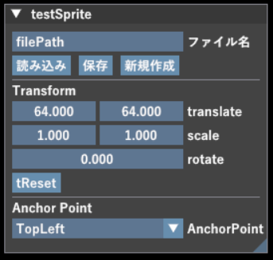

# Sprite Documentation

このドキュメントでは、Engineに実装されているSpriteの使い方を説明します。<br>

## 目次
1. [初期化～描画まで](#初期化～描画まで)
2. [ImGuiの使用](#ImGuiの使用)
---

# 初期化～描画まで
## 初期化

`Engine/2d/Sprite.h`で、使用することができます：

```cpp
// std名前空間のunique_ptrを使用
std::unique_ptr<Sprite> testSprite_ = std::make_unique<Sprite>();

// 第一引数 は resources/Image/ 以降の file path（相対パス）
// 第二引数 translate デフォで {0.0f, 0.0f}
// 第三引数 scale デフォで {1.0f, 1.0f}
testSprite_->Initialize("testSprite.png", { 0.0f, 0.0f }, { 1.0f, 1.0f });

// ImGuiで作成したJSONファイルから初期化後に値を読み込むことも可能
// ファイルは resources/Data/Json/Sprite/ 以下に .json 拡張子で配置してください
// 例: "resources/Data/Json/Sprite/testSprite.json" を読み込む場合は
// 引数に "testSprite" を渡します
testSprite_->LoadFromJson("testSprite");
```

## 更新

毎フレーム `Update()` を呼び出してください。呼ばないと画面に描画されません：

```cpp
// 行列計算
testSprite_->Update();
```

## 描画

`Draw()` を呼び出して描画します：
```cpp
testSprite_->Draw();
```

## ImGuiの使用

呼び出す際に入力した文字列で以下のようなImGuiが開きます：
```cpp
testSprite_->DrawImGui("testSprite");
```

### 操作
・ファイル名入力：操作したいJsonファイル名を入力してください（`resources/Data/Json/Sprite/` 以下、拡張子 `.json` は不要）<br>
・読み込み　　　：指定したファイル名と一致するJsonファイルから値を読み込みます <br>
・保存　　　　　：現在の値を同名のJsonファイルへ書き出します（存在しなければ作成されます） <br>
・新規作成　　　：入力されたファイル名で新しいJsonファイルを作成します <br>

・SRT：スライダーで調整します <br>
・AnchorPoint：左上、左下、右上、右下、中央の五か所から選べます